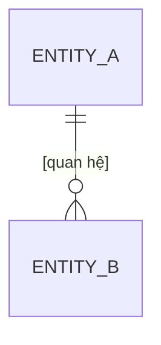

**[Tên dự án]**
**Tài liệu Phát triển Dự án — Tổng quan**
Phiên bản Draft 0.1.0 · [DD/MM/YYYY]

| **Dự án** | [Tên dự án] |
|---|---|
| **Loại tài liệu** | Tài liệu Phát triển Dự án (Tổng quan) |
| **Trạng thái** | Draft – Phiên bản 0.1.0 |
| **Được chuẩn bị bởi** | [Đội / Tổ chức] |
| **Ngày** | [DD/MM/YYYY] |

**Mục lục**

| [ Ghi chú template — XÓA trước khi phát hành: Đây là khung tài liệu tổng quan theo chuẩn model_001. Điền vào các ô `[...]`, thay bảng/placeholder bằng nội dung thật, rồi render ra `.docx` bằng `business_analysis`/`srs` generator. Các phần chi tiết (requirements, ERD, backlog…) sống ở các file riêng trong `docs/`; tài liệu này chỉ TỔNG HỢP và trỏ tới chúng. ] |

# Lịch sử Phiên bản

| Phiên bản | Ngày | Mô tả | Tác giả |
|---|---|---|---|
| 0.1.0 | [DD/MM/YYYY] | Khởi tạo khung tài liệu | [Tên] |

# Giới thiệu

- **Mục đích**: [Tài liệu này cung cấp bức tranh tổng quan về việc phát triển dự án [Tên dự án] — bối cảnh, mục tiêu, phạm vi, yêu cầu, mô hình dữ liệu, backlog tính năng và lộ trình.]
- **Phạm vi tài liệu**: [Tài liệu mức tổng quan, tổng hợp các artifact chi tiết. Không thay thế tài liệu đặc tả chi tiết (SRS) hay backlog chi tiết.]
- **Đối tượng**: [Stakeholder, PO/PM, đội phát triển, QA, khách hàng…]

## Định nghĩa, Từ viết tắt và Ký hiệu

| Thuật ngữ / Từ viết tắt | Định nghĩa |
|---|---|
| BA | Business Analysis / Business Analyst |
| ERD | Entity-Relationship Diagram |
| NFR | Non-functional Requirement (Yêu cầu phi chức năng) |
| [Từ khác] | [Định nghĩa] |

## Tổng quan Tài liệu

[Mô tả ngắn bố cục các phần còn lại của tài liệu này và quan hệ tới các artifact chi tiết trong `docs/`.]

# Tổng quan Dự án

## Bối cảnh

[Vì sao dự án ra đời — vấn đề/cơ hội kinh doanh, hiện trạng (as-is) tóm tắt.]

## Mục tiêu

| # | Mục tiêu | Tiêu chí thành công (đo lường được) |
|---|---|---|
| 1 | [Mục tiêu kinh doanh] | [KPI / chỉ số] |
| 2 | [Mục tiêu sản phẩm] | [KPI / chỉ số] |

## Phạm vi

| Trong phạm vi (In scope) | Ngoài phạm vi (Out of scope) |
|---|---|
| [Hạng mục sẽ làm] | [Hạng mục KHÔNG làm trong phase này] |

## Các bên liên quan (Stakeholders)

| Vai trò | Người / Nhóm | Quan tâm chính |
|---|---|---|
| [Product Owner] | [Tên] | [Mối quan tâm] |
| [Khách hàng] | [Tên] | [Mối quan tâm] |

## Giả định & Ràng buộc

- **Giả định**: [Điều kiện được cho là đúng để dự án triển khai.]
- **Ràng buộc**: [Giới hạn về thời gian, ngân sách, công nghệ, pháp lý…]

# Tổng quan Yêu cầu

[Tóm tắt các nhóm yêu cầu chính. Danh sách yêu cầu đầy đủ (mã `REQ-XXXX`) nằm ở [`requirements.md`](requirements.md).]

| Nhóm (Topic) | Số lượng REQ | Tóm tắt |
|---|---|---|
| [Nhóm 1] | [n] | [Mô tả ngắn] |
| [Nhóm 2] | [n] | [Mô tả ngắn] |

# Mô hình Dữ liệu (ERD)

[Sơ đồ thực thể–quan hệ tổng quan. Chi tiết + edge case nằm ở [`erd.md`](erd.md).]

| Thực thể chính | Vai trò trong hệ thống |
|---|---|
| [ENTITY_A] | [Mô tả] |
| [ENTITY_B] | [Mô tả] |

# Backlog Tính năng

[Tổng quan backlog theo cấu trúc Epic → Feature → User Story. Backlog đầy đủ (kèm mã `EPIC-XX` / `FEAT-XXX` / `STORY-XXX`, Priority, Status) nằm ở [`backlog.md`](backlog.md).]

| Epic | Mã | Số Feature | Mô tả ngắn |
|---|---|---|---|
| [Tên Epic] | EPIC-01 | [n] | [Mô tả] |
| [Tên Epic] | EPIC-02 | [n] | [Mô tả] |

# Kế hoạch & Lộ trình

| Giai đoạn | Phạm vi (Epic/Feature) | Mốc thời gian | Phụ thuộc |
|---|---|---|---|
| [Phase 1] | [EPIC-01, EPIC-02] | [Tháng/Quý] | [—] |
| [Phase 2] | [EPIC-03] | [Tháng/Quý] | [Phase 1] |

# Yêu cầu Phi chức năng

| Loại NFR | Yêu cầu | Tiêu chí chấp nhận |
|---|---|---|
| Hiệu năng | [VD: thời gian phản hồi ≤ N giây] | [Cách đo] |
| Bảo mật | [VD: phân quyền theo vai trò (RBAC)] | [Cách đo] |
| Độ tin cậy & Sẵn sàng | [VD: uptime ≥ N%] | [Cách đo] |
| Khả năng sử dụng | [...] | [...] |
| Khả năng mở rộng | [...] | [...] |
| Khả năng bảo trì | [...] | [...] |

# Phụ lục — Tài liệu liên quan

| Tài liệu | Nội dung | Vị trí |
|---|---|---|
| Danh sách yêu cầu | Bảng `REQ-XXXX` đầy đủ | [`requirements.md`](requirements.md) |
| Backlog tính năng | Epic → Feature → Story + AC | [`backlog.md`](backlog.md) |
| ERD | Mô hình dữ liệu chi tiết | [`erd.md`](erd.md) |
| Gap & Impact Analysis | Phân tích thay đổi (CR) | [`gap-analysis.md`](gap-analysis.md) |
| SRS | Đặc tả yêu cầu chi tiết (IEEE) | [`../output/`](../output/) (khi sinh) |
