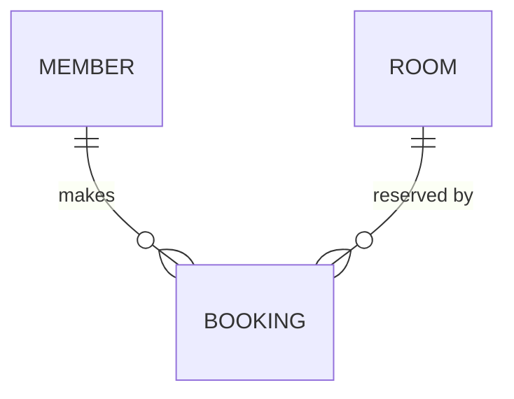

# Example · business analysis walkthrough

A worked walkthrough — raw input consolidated into a requirements table, then an ERD and a feature list derived from it. Uses a generic "RoomBooking" scenario.

## Input

The user drops into `input/`:

- `vendor-brief.docx` — a two-page brief
- `kickoff-notes.md` — meeting notes

After session setup (Core Rule), these are ingested into `context/` as `context.md` files.

## Step 1 · Consolidate the requirements table

The analysis is requested on **2026-05-21 14:30**. Every requirement found across both inputs goes into one timestamp batch.

```markdown
## 2026-05-21 14:30 — vendor-brief.docx + kickoff-notes.md

| Req code | Topic | Criteria | Description | Ref. Docs | Q&A | Remarks |
|---|---|---|---|---|---|---|
| REQ-0001 | Booking | Create a booking | A member books an available room for a time slot. | vendor-brief.docx §2 "Booking" | | |
| REQ-0002 | Booking | Cancel a booking | A member cancels their own booking before it starts. | vendor-brief.docx §2 "Booking" | | |
| REQ-0003 | Rooms | Room catalogue | An admin maintains the list of rooms and capacities. | kickoff-notes.md, "Rooms" topic | | |
| REQ-0004 | Members | Member directory | The system holds member accounts. | vendor-brief.docx §1 "Users" | | |
```

Written to `context/.../requirements/context.md`; `requirements.xlsx` generated into `output/`.

## Step 2a · Derive the ERD

From the entities implied by the requirements (member, room, booking):



Reading the cardinalities surfaces an **edge case** for the user: a `BOOKING` requires both a `MEMBER` and a `ROOM` — what happens to existing bookings when a `ROOM` is removed from the catalogue? → raise as a question, likely a new requirement.

Written to `context/.../erd/context.md` as Mermaid. No `.drawio` yet — the user has not asked for one.

## Step 2b · Derive the feature list

```markdown
| Feature ID | Feature Name | Ref. Req (Feature) | Description (Feature) | User Story | Ref. Req (Story) | Description (Story) | Priority | Ready? | Done? | In Scope |
|---|---|---|---|---|---|---|---|---|---|---|
| FEAT-0001 | Booking management | REQ-0001, REQ-0002 | Members create and cancel bookings. | A member can book an available room. | REQ-0001 | Pick a room + slot. | High | ☑ | ☐ | In scope |
| | | | | A member can cancel their booking. | REQ-0002 | Before start time only. | Medium | ☑ | ☐ | |
| FEAT-0002 | Room catalogue | REQ-0003 | Admin maintains rooms. | An admin can add or edit a room. | REQ-0003 | Name + capacity. | Medium | ☐ | ☐ | Next phase |
```

Written to `context/.../features/context.md`; `features.xlsx` generated into `output/` with the `Priority` / `In Scope` dropdowns and `Ready?` / `Done?` checkboxes.

## Recap — what went right

- ✅ Requirements table built **first** — both later artifacts share one source.
- ✅ ERD cardinality surfaced an edge case the brief never stated.
- ✅ Every feature cites its `REQ-` codes — traceable.
- ✅ ERD stayed Mermaid `.md` — no `.drawio` until asked.
- ✅ Tables saved as `.md` (context) + `.xlsx` (pilot).
