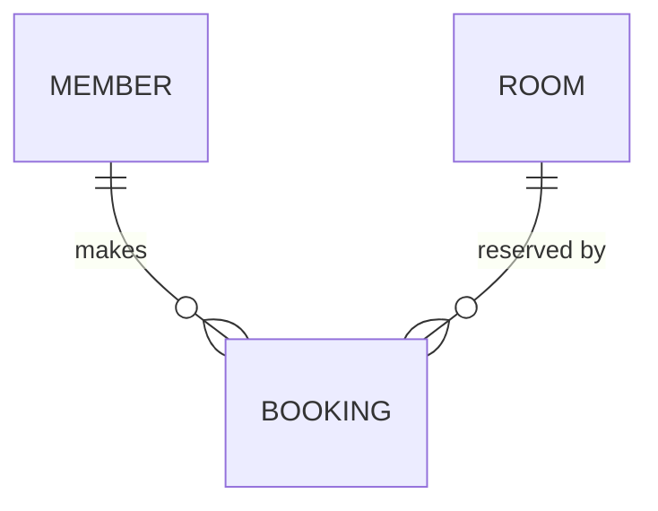

# Example · end-to-end pipeline walkthrough

A worked walkthrough of the full pipeline — raw input to a finished SRS. Generic "RoomBooking" scenario.

## Input

`input/` holds `vendor-brief.docx` and `kickoff-notes.md`, ingested into `context/` as `context.md` files.

## Stage 1 · Requirements

Analysis requested **2026-05-21 14:30**. Every requirement found across both inputs goes into one timestamp batch.

```markdown
## 2026-05-21 14:30 — vendor-brief.docx + kickoff-notes.md

| Req code | Topic | Criteria | Description | Ref. Docs | Q&A | Remarks |
|---|---|---|---|---|---|---|
| REQ-0001 | Booking | Create a booking | A member books an available room for a time slot. | vendor-brief.docx §2 | | |
| REQ-0002 | Booking | Cancel a booking | A member cancels their own booking before it starts. | vendor-brief.docx §2 | | |
| REQ-0003 | Rooms | Room catalogue | An admin maintains the list of rooms and capacities. | kickoff-notes.md, "Rooms" | | |
```

## Stage 2a · ERD



## Stage 2b · Feature backlog (Epic → Feature → User Story)

```markdown
| Epic ID | Epic Name | Feature ID | Feature Name | Ref. Req (Feature) | Description (Feature) | Story ID | User Story | Ref. Req (Story) | Description (Story) | Priority | Ready? | Done? | In Scope |
|---|---|---|---|---|---|---|---|---|---|---|---|---|---|
| EPIC-0001 | Booking | FEAT-0001 | Booking management | REQ-0001, REQ-0002 | Members create and cancel bookings. | US-0001 | A member can book an available room. | REQ-0001 | Pick a room + slot. | High | ☑ | ☐ | In scope |
| | | | | | | US-0002 | A member can cancel their booking. | REQ-0002 | Before start time. | Medium | | | |
| | | FEAT-0002 | Room catalogue | REQ-0003 | Admin maintains rooms. | US-0003 | An admin can add or edit a room. | REQ-0003 | Name + capacity. | Medium | ☐ | ☐ | Next phase |
```

## Stage 3 · Business rules + edge cases (walk the ERD per feature)

For **FEAT-0001 (Booking management)** — the feature touches `MEMBER`, `ROOM`, `BOOKING`. Walking the ERD:

- `ROOM ||--o{ BOOKING` → **business rule**: *A room cannot hold two overlapping bookings.* (WHAT must always be true — declarative, one rule.)
- `BOOKING` requires exactly one `ROOM` → **edge case**: what happens to existing bookings when a `ROOM` is deleted from the catalogue?
- `MEMBER ||--o{ BOOKING` → **business rule**: *Every booking belongs to exactly one member.*

## Stage 4 · SRS

The SRS is written: module `Booking` = `EPIC-0001`; a detailed use-case spec for `FEAT-0001`.

```markdown
### Đặc tả Chi tiết — Booking management (FEAT-0001)

#### Đặc tả Use Case
| Mã tính năng (Use case / Feature) | FEAT-0001 |
| ... | ... |
| Luồng ngoại lệ / Xử lý lỗi | Room deleted while a booking exists → ... (edge case from stage 3) |

#### Business Rules / System Behavior
| Mã BR | Mô tả |
|---|---|
| | A room cannot hold two overlapping bookings. |
| | Every booking belongs to exactly one member. |
```

Each BR states WHAT must always be true — declarative, one rule per row.

## Recap

- ✅ Requirements consolidated first — the single source.
- ✅ ERD + feature backlog derived in parallel; backlog has the full Epic → Feature → User Story hierarchy, every level coded.
- ✅ Business rules + edge cases discovered by walking the ERD per feature.
- ✅ Everything written into the SRS — modules = epics, use-case specs reference `FEAT` codes, BRs are declarative.
- ✅ Full chain traceable by code: `REQ-0001` → `FEAT-0001` / `US-0001` → the SRS spec.
