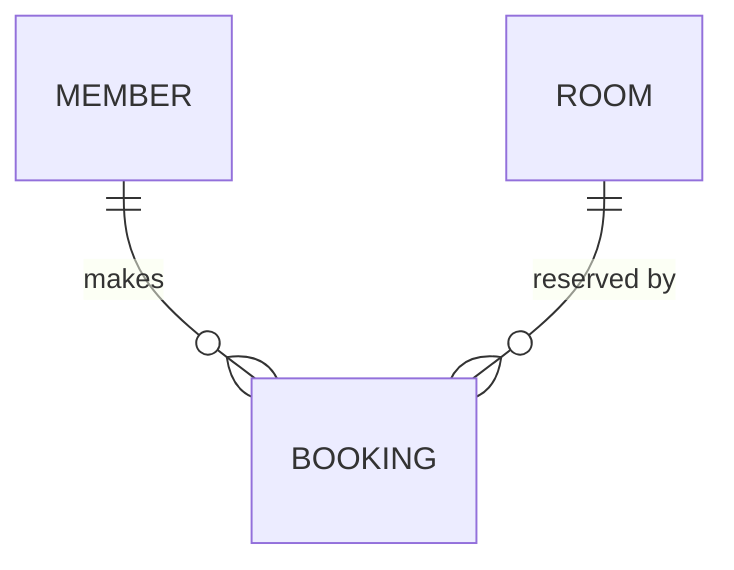

# Example · ERD walkthrough

A short worked example — building an ERD from a handful of requirements. Generic "RoomBooking" scenario.

## Input — relevant requirements

| Req code | Criteria |
|---|---|
| REQ-0001 | A member books an available room for a time slot. |
| REQ-0003 | An admin maintains the list of rooms and capacities. |
| REQ-0004 | The system holds member accounts. |

## Step 1 · Identify entities

From the requirements: `MEMBER`, `ROOM`, `BOOKING`.

## Step 2 · Draw relationships with crow's-foot cardinality

- A `MEMBER` makes zero-or-many `BOOKING`s → `||--o{`.
- A `ROOM` is reserved by zero-or-many `BOOKING`s → `||--o{`.
- A `BOOKING` requires exactly one `MEMBER` and exactly one `ROOM`.

## Step 3 · Author as Mermaid

Saved into the `.md` context file. No `.drawio` — the user has not asked for one.

## Step 4 · Audit for edge cases

Walking the cardinalities surfaces a question for the user: a `BOOKING` requires a `ROOM` — **what happens to existing bookings when a `ROOM` is removed from the catalogue?** → raise it; likely a new requirement / business rule.

## Recap

- ✅ Every entity traced to a requirement.
- ✅ Crow's-foot cardinality made an unstated edge case visible.
- ✅ Stayed Mermaid `.md` — no `.drawio` until asked.
