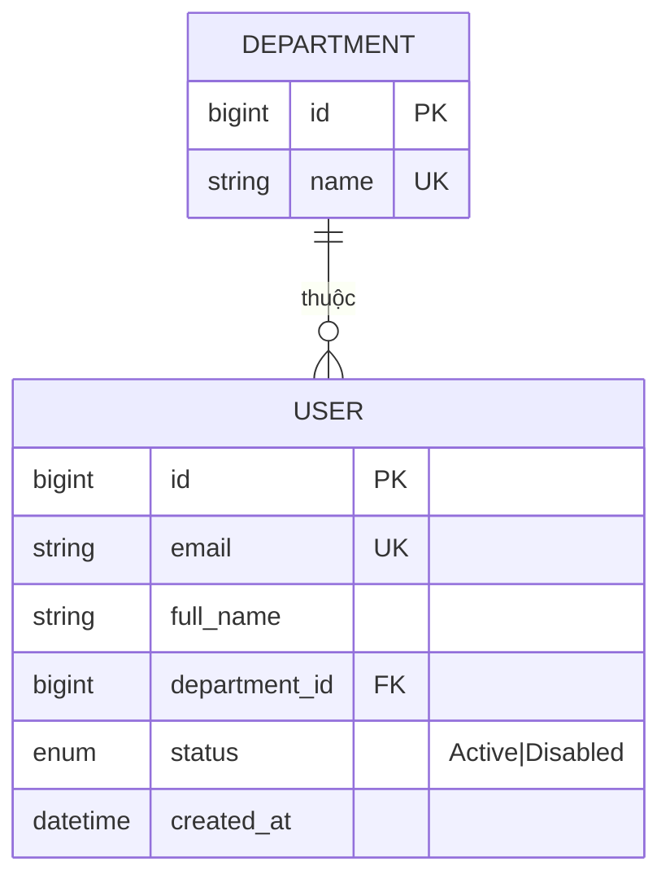

# ERD — Entity Relationship Diagram

> Backed by skill [`diagram/erd`](../MasterMind/models/model_001/diagram/erd/).
> Source: derive từ `docs/requirements.md` + `docs/backlog.md`. Authored as Mermaid.

## Domain groups

| Domain | Entities (placeholder — agent fill) |
|---|---|
| Auth & People | `USER`, `DEPARTMENT`, `PERMISSION_GROUP` |
| `<Domain 1>` | ... |
| `<Domain 2>` | ... |

## ER Diagram (Mermaid)

## Cardinality cheatsheet

| Notation | Nghĩa |
|---|---|
| `||--||` | 1 : 1 |
| `||--o{` | 1 : 0-or-many |
| `||--|{` | 1 : 1-or-many |
| `}o--o{` | many : many |

## Edge cases từ cardinality

Khi viết relationship, walk qua từng cardinality để tìm BR + edge case:

| Quan hệ | Cardinality | Edge case / BR |
|---|---|---|
| `<Entity>` ↔ `<Entity>` | `||--|{` | Khi tạo Parent, bắt buộc ≥1 Child? |

## Render `.drawio` (chỉ khi cần)

Mặc định Mermaid `.md` là source of truth. Render sang `.drawio` chỉ khi:
- Share với non-technical
- Muốn edit visually
- Export PDF

Render bằng `core/diagram/_shared/scripts/`.

## Workflow

1. Agent đọc `docs/requirements.md` → identify entities (mỗi entity ≥ 1 requirement support)
2. Agent vẽ relationships dựa trên hierarchy + dependencies trong backlog
3. Walk cardinality → fill bảng "Edge cases" → surface BR cần đặc tả
4. SRS (skill `srs`) reference entity ID từ đây cho use-case spec
5. Khi CR thay đổi entity, update ERD trước (single source of truth cho data model)
