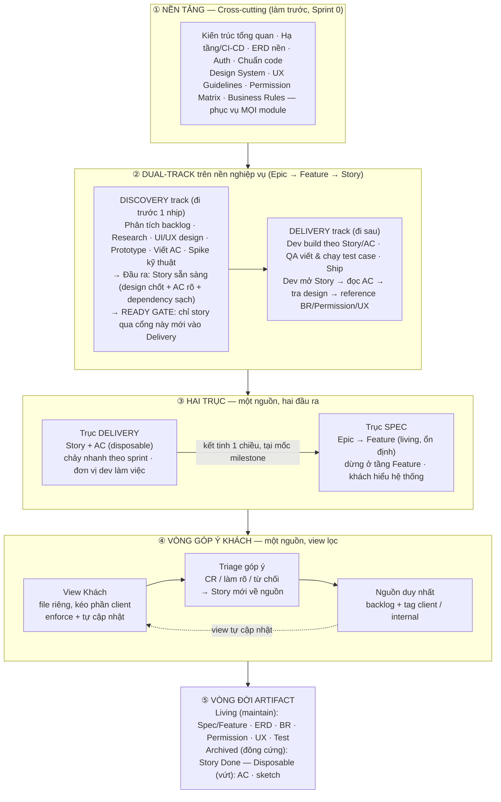

**[Tên Công ty]**
**Quy trình Phát triển Phần mềm**
Phiên bản Draft 0.1.0 · [DD/MM/YYYY]

| **Tài liệu** | Quy trình Phát triển Phần mềm |
|---|---|
| **Phạm vi áp dụng** | Toàn công ty — áp dụng cho **mọi dự án phần mềm** |
| **Loại tài liệu** | Tài liệu Quy trình (Process / SOP) |
| **Trạng thái** | Draft – Phiên bản 0.1.0 |
| **Được chuẩn bị bởi** | [Phòng / Đội] |
| **Ngày** | [DD/MM/YYYY] |

**Mục lục**

# Lịch sử Phiên bản

| Phiên bản | Ngày | Mô tả | Tác giả |
|---|---|---|---|
| 0.1.0 | [DD/MM/YYYY] | Ban hành quy trình phát triển phần mềm chuẩn | [Tên] |

# Giới thiệu

- **Mục đích**: Định nghĩa quy trình phát triển phần mềm chuẩn của công ty ở dạng **nguyên tắc tổng quát**, áp dụng cho mọi dự án.
- **Phạm vi áp dụng**: Toàn công ty, mọi dự án, mọi vai trò.
- **Cách đọc tài liệu này**: Đây là **mô hình tham chiếu**, không phải mệnh lệnh phải làm hết mọi tầng. Áp dụng phần nào giải quyết nỗi đau thật của team; ít tầng hơn luôn thắng nếu không có lý do cụ thể.

# Toàn cảnh quy trình

Bức tranh tổng thể — chi tiết từng phần ở các mục bên dưới.



# Năm nguyên tắc nền (xuyên suốt)

Năm nguyên tắc chi phối mọi quyết định trong quy trình:

1. **Một nguồn, nhiều view.** Không tạo bản sao tài liệu để rồi phải đồng bộ. Một nguồn duy nhất; mỗi đối tượng đọc một view lọc phù hợp.
2. **Tổ chức theo cách dùng, không theo phân loại.** Mỗi tài liệu sống gần nơi nó được dùng nhất — xếp theo "ai cần nó, khi nào", không theo "loại tài liệu".
3. **Viết một nơi, reference nhiều chỗ.** Quy tắc dùng chung định nghĩa một lần, mọi nơi trỏ tới — không lặp lại để tránh lệch nhau.
4. **Phân biệt vòng đời.** Living (maintain) / Archived (đông cứng) / Disposable (vứt). Đừng maintain thứ vốn disposable.
5. **Thêm tầng/tài liệu chỉ khi có nỗi đau thật.** Mô hình đầy đủ là để tham chiếu, không phải bắt buộc làm hết.

# Nhóm cross-cutting vs nhóm nghiệp vụ

Mọi công việc chia hai nhóm theo phép thử: **"cái này phục vụ một module hay mọi module?"**

| Nhóm | Phục vụ | Bám Epic/Feature? | Ví dụ | Cách tổ chức |
|---|---|---|---|---|
| **Cross-cutting** | Mọi module | ❌ Không | Kiến trúc tổng quan, hạ tầng/CI-CD, mô hình dữ liệu nền, auth, chuẩn code, design system, UX guidelines, permission matrix (RBAC), business rules | Theo mối quan tâm kỹ thuật; làm trước như nền móng |
| **Nghiệp vụ** | Từng module | ✅ Có | Phân tích backlog, ước lượng, đặc tả chức năng, xác định discovery/spike | Theo Epic → Feature → Story |

> **Cảnh báo**: Nếu lập kế hoạch chỉ dựa trên cây Epic/Feature, bạn sẽ **bỏ sót toàn bộ nhóm cross-cutting** — phải chủ động lên kế hoạch riêng cho nó.

# Cấu trúc phân cấp công việc

```
EPIC (module nghiệp vụ — khách tư duy theo đây)
  └── FEATURE (capability gom nội bộ; ĐỒNG THỜI là đơn vị khách duyệt)
        └── USER STORY (đơn vị dev làm)
              └── AC (sống trong Story)
```

Phân vai:

- **Epic** — nhóm module, dùng ngôn ngữ khách.
- **Feature** — gom capability để dev tổ chức delivery; **đồng thời là đơn vị khách duyệt** (trạng thái nghiệm thu gắn ở đây).
- **User Story** — đơn vị dev build & test (AC gắn ở đây).

> Một Feature thường có **nhiều story** (theo vai trò, theo độ phức tạp). Khách nghiệm thu ở cấp Feature (một dòng); các story là chi tiết delivery bên dưới. Đây là mô hình 3 cấp tinh gọn — chỉ thêm tầng khi thực sự đau vì bùng nổ số lượng.

# Dual-track Agile

Design và các việc khám phá có nhịp khác dev — **không ép cùng sprint**.

- **Discovery track (đi trước một nhịp)** — công việc khám phá (divergent): phân tích backlog, research, UI/UX design, prototype, validate, viết AC, spike kỹ thuật. **Đầu ra: story sẵn sàng.**
- **Delivery track (đi sau)** — công việc hội tụ (convergent): dev build, QA test, ship. **Chỉ nhận story đã qua Ready Gate.**

**Cơ chế lệch pha**: khi dev build Sprint N, discovery làm cho Sprint N+1 → dev luôn có việc sẵn, không chờ.

**Ready Gate (Definition of Ready)** — van chặn: story chỉ vào sprint dev khi *design chốt + AC rõ + dependency sạch*. Chưa Ready thì ở lại Discovery.

**Tránh hai cực đoan**: thiết kế hết trước (thác nước) ✗ và design cùng sprint dev (chờ nhau) ✗. Điểm cân bằng là **đi trước vừa đủ một nhịp**. Module rủi ro cao cần spike riêng dài hơn trước khi vào nhịp đều. Với team nhỏ, "hai track" là cùng nhóm người làm hai loại việc lệch pha — không cần hai board riêng, chỉ cần giữ kỷ luật Ready Gate.

# Hai trục: Delivery vs Spec

**Không gộp tài liệu — gộp nguồn.** Một nguồn, hai đầu ra.

| | Trục Delivery (cho team) | Trục Spec (cho khách) |
|---|---|---|
| Đơn vị | Story + AC | Epic → Feature (dừng ở Feature, không xuống Story) |
| Tính chất | Chảy nhanh theo sprint, biến động liên tục | Living, ổn định, ngôn ngữ business |
| Vòng đời | AC disposable, Story archived | Living |
| Tổ chức theo | Cách team làm hiệu quả | Cách khách hiểu hệ thống |

Mỗi Feature ở trục Spec chỉ cần: **mô tả năng lực (2–3 câu) + thao tác chính + reference BR + link design**. Không viết AC chi tiết, không viết hành vi từng story, không viết cách implement.

**Quan hệ (tránh double effort)**: thông tin chảy **một chiều delivery → spec**, chỉ tại điểm **milestone**. Không đồng bộ liên tục. Spec viết ở tầng cao hơn nên phần lớn thay đổi AC không lan tới spec. Nếu không có lý do thật (hợp đồng) để giữ spec sống, có thể dùng **automated test làm spec sống** thay thế.

# Phân lớp tài liệu — ai đọc / sở hữu gì

## Dev trong sprint

Dùng **Story làm trạm trung tâm**, đọc theo thứ tự:

1. **Story statement** (tại sao)
2. **AC** (thế nào là Done — nhìn nhiều nhất)
3. **Design / wireframe** (UI, các state)
4. **Reference** tới BR / permission matrix / UX guidelines khi AC trỏ tới

Spec hầu như không cần trong sprint. Story **không chứa tất cả** mà **dẫn tới tất cả qua reference**. Thiếu thông tin để build = story chưa Ready = **hỏi ngay, đừng đoán**, rồi cập nhật AC.

## QA

- **Sở hữu & maintain**: test case / test suite, bug report, test report.
- **Đọc nhưng không maintain**: AC, BR, spec, design (là input để viết test case).
- AC là input của QA → biến thành **test case** (output, sống lâu qua regression).
- Team automation: AC → automated test; test trở thành **source of truth của hành vi**.

## Phân biệt AC vs BR

| | Business Rule (BR) | Acceptance Criteria (AC) |
|---|---|---|
| Bản chất | Quy tắc **luôn đúng**, cross-cutting | Hành vi của **một story** |
| Vòng đời | Living, có ID | Disposable |
| Trả lời câu hỏi | "Điều gì luôn phải đúng?" | "Thế nào là story Done?" |

**Phép thử**: *"Câu này còn đúng nếu đổi màn / đổi thao tác không?"* — còn đúng khắp nơi là **BR**, chỉ cục bộ là **AC**. AC **tham chiếu** BR, không chép.

## Quy ước viết AC

- Dùng ngôn ngữ tự nhiên (**"Khi… thì…"**) thay Given-When-Then cho dễ đọc.
- Mỗi AC **một điều kiện** kiểm chứng được.
- Mô tả **what**, không phải **how**.
- Gồm cả **edge case**.
- **Đủ dùng cho sprint** — không hơn.
- **Không** liệt kê field tĩnh của màn (đó là việc của thiết kế UI) — chỉ đưa field vào AC khi nó **hiện / ẩn / disable / bắt buộc theo điều kiện**.

# Vòng góp ý khách (khép kín)

```
Nguồn duy nhất (backlog + tag [client]/[internal])
  → View Khách (file riêng, kéo phần [client] — enforce + tự cập nhật)
  → Khách đọc & góp ý (cột phản hồi riêng)
  → Triage (làm rõ / sửa nhỏ / CR thật / từ chối)
  → Story mới về nguồn (đánh Superseded story cũ nếu thay)
  → Dev nhận theo sprint → cập nhật nguồn
  → View Khách tự cập nhật → khách thấy mới nhất (khép kín)
```

**Nguyên tắc enforce**: lọc trong cùng file chỉ là che mắt (khách tự bỏ lọc được). Muốn enforce phải **tách file riêng** — quyền ở cấp file, khách chỉ được cấp quyền lên file view.

**Kỷ luật**: khách luôn đọc **view động trỏ về nguồn**, không đọc bản sao tĩnh. Nếu hợp đồng cần tài liệu ký được, **generate tự động từ nguồn tại mốc** (ảnh chụp), không maintain tay.

# Vòng đời artifact

| Vòng đời | Nghĩa | Gồm |
|---|---|---|
| **Living** | Maintain lâu dài, phản ánh hiện trạng | Spec/feature, mô hình dữ liệu, business rules, permission matrix, UX guidelines, automated test, API contract |
| **Archived** | Đông cứng — giữ, không sửa, không xóa, không tái dùng ID | Story statement sau khi Done → decision log ("đã quyết gì, ai yêu cầu, vì sao"). Trả lời "đã làm gì", không trả lời "hệ thống nay làm gì" |
| **Disposable** | Vứt sau sprint | AC chi tiết (chết hoặc thành test), sketch, ghi chú họp |

> **Source of truth của hiện trạng** = code + automated test + spec living. **Không** phải story/AC cũ (chúng là lịch sử). Đừng xây tài liệu hiện trạng bằng cách gom story cũ.

# Xử lý thay đổi (Change Request)

## Giữa sprint — phân 4 loại

| Loại | Tình huống | Xử lý |
|---|---|---|
| **A. Làm rõ** | Hiểu chưa rõ | Hỏi ngay, update AC, làm tiếp |
| **B. Sót chi tiết** | Thiếu một AC | Thêm AC, làm nếu effort nhỏ |
| **C. Sửa nhỏ scope** | Scope nhích nhẹ | Negotiate với PO, không đe dọa Sprint Goal |
| **D. Thay đổi lớn** | Đổi nhiều | Không nhồi vào story đang làm; tách story mới cho sprint sau |

Hai nguyên tắc: **PO quyết nội dung story**; **Sprint Goal là ranh giới**. Cảnh giác **scope creep ngầm** — nhiều thay đổi nhỏ tích lũy nguy hiểm hơn một thay đổi lớn.

## Sau khi story đã Done

Story cũ là **archived**, giữ nguyên không sửa. Tạo **story mới**, viết AC dạng **delta** ("trước [cũ], nay [mới]") + một **AC regression** ("phần còn lại không đổi"). Hiện trạng tra ở test + spec; không lo AC cũ/mới chồng lấn vì story là lịch sử.

# Thứ tự khởi động dự án

1. **Nền kỹ thuật trước (Foundation / Sprint 0)**: kiến trúc, hạ tầng, mô hình dữ liệu nền, auth — **walking skeleton** đi được end-to-end.
2. **Song song**: phân tích backlog theo Epic/Feature để hiểu phạm vi, phát hiện spike, ước lượng, chọn milestone đầu.
3. **Rồi**: discovery cho feature của milestone đầu (spec + design + AC).
4. **Delivery track** bắt đầu khi có story Ready.

> Cross-cutting là nền của Foundation; nghiệp vụ là discovery track bắt đầu cho từng module.

# Tổng kết

- **Cross-cutting làm nền** (mọi module dùng chung), **nghiệp vụ chạy trên nền** (theo Epic/Feature).
- **Discovery đi trước, Delivery đi sau, lệch pha** — Ready Gate là van chặn.
- **Delivery (Story/AC, biến động)** và **Spec (Feature, ổn định)** là hai view của một nguồn, kết tinh một chiều tại mốc.
- Khách đọc **view động lọc từ nguồn**, không bản sao, không double sync.
- **Living thì maintain, Archived thì giữ, Disposable thì vứt** — đừng maintain nhầm.
